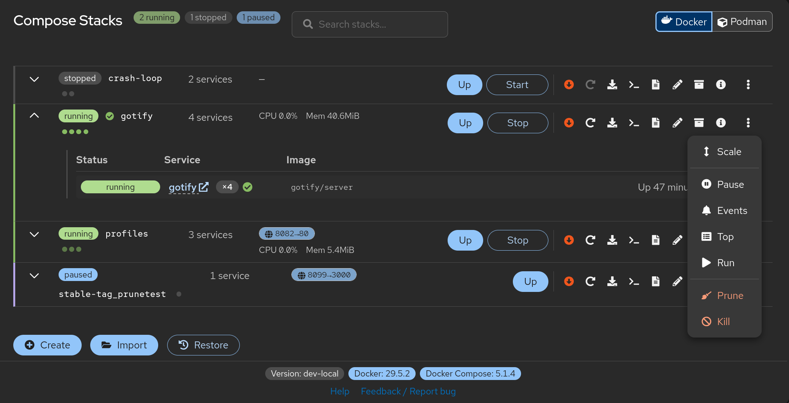

# Cockpit Docker Compose Plugin

[](https://github.com/RXTX4816/cockpit-compose/actions/workflows/ci.yml)
[](https://github.com/RXTX4816/cockpit-compose/actions/workflows/pkg-ci.yml)

Docker Compose management for [Cockpit](https://cockpit-project.org) — start, stop, and monitor your stacks from a clean web UI.



## Features

- Dashboard listing all stacks with live status and container stats (auto-refreshing)
- Create new Compose Stacks or import existing ones - directly from the WebUI
- Start, stop, restart, pause/unpause, pull, prune and kill stacks with one click
- Live log viewer per stack
- Interactive shell into any running service
- YAML editor with syntax validation and auto-snapshot before saving + .ENV editor

## Requirements

- Cockpit 300+
- Docker with the Compose plugin (`docker compose` v2+)

## Prerequisites

Docker is not installed by default on most distros. Install it and make sure it is running and add your user to the docker group.

```bash
sudo usermod -aG docker $USER
```

Cockpit comes pre-installed on Fedora and most RHEL-based systems. On other distros it might need to be installed and started:

```bash
sudo systemctl enable --now cockpit.socket
```

## Installation

### Arch Linux

```bash
paru -S cockpit-compose
```

### Fedora / RHEL / CentOS Stream / openSUSE

Download the `.rpm` from the [Releases](https://github.com/RXTX4816/cockpit-compose/releases) page:

```bash
sudo rpm -i cockpit-compose-X.Y.Z-1.noarch.rpm
```

### Debian / Ubuntu / Linux Mint / Pop!\_OS

Download the `.deb` from the [Releases](https://github.com/RXTX4816/cockpit-compose/releases) page:

```bash
sudo apt install ./cockpit-compose_X.Y.Z-1_all.deb
```

### Manual

Download the latest release tarball from the [Releases](https://github.com/RXTX4816/cockpit-compose/releases) page.

```bash
tar -xzf cockpit-compose-X.Y.Z.tar.gz
sudo mkdir -p /usr/share/cockpit/cockpit-compose
sudo cp -r cockpit-compose/* /usr/share/cockpit/cockpit-compose/
```

Then open Cockpit in your browser or hard-refresh the page — **Docker Compose** appears in the left navigation.

## Development

**Requirements:** Node.js 20+, npm

```bash
git clone https://github.com/RXTX4816/cockpit-compose.git
cd cockpit-compose
npm install
npm run build
```

To develop with live reload inside Cockpit, symlink the plugin:

```bash
mkdir -p ~/.local/share/cockpit
ln -s "$PWD/src" ~/.local/share/cockpit/cockpit-compose
npm run watch
```

Open `http://localhost:9090` — **Docker Compose** appears in the sidebar automatically.

| Command | Description |
|---|---|
| `npm run build` | Production build |
| `npm run watch` | Build with file watching |
| `npm run typecheck` | TypeScript type check |
| `npm run lint` | ESLint |
| `npm run test` | Run tests |
| `npm run test:coverage` | Coverage report |

## Translations

The UI language follows Cockpit's language setting.

<!-- i18n-coverage-start -->
| Language | Code | Coverage |
|---|---|---|
| English | `en` | 100% (source) |
| German | `de` | 100% |
| Polish | `pl` | 99% |
<!-- i18n-coverage-end -->

To add a new language, copy `src/i18n/locales/en.json`, translate the values, and register the file in `src/i18n/index.ts`.

## Contributing

Bug reports and feature requests: open an issue on [GitHub](https://github.com/RXTX4816/cockpit-compose/issues).

Pull requests are welcome. Please make sure your changes pass CI (lint, typecheck, tests, and build) before submitting. See [CONTRIBUTING.md](CONTRIBUTING.md) for commit conventions and development setup. Open an issue first for significant feature additions.

## License

MIT
