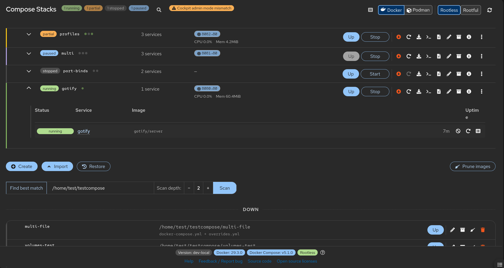

# Cockpit Docker/Podman Compose Plugin

[](https://github.com/RXTX4816/cockpit-compose/actions/workflows/ci.yml)
[](https://github.com/RXTX4816/cockpit-compose/actions/workflows/pkg-ci.yml)

Docker and Podman Compose management for [Cockpit](https://cockpit-project.org) — start, stop, and monitor your stacks from a clean web UI.



## Features

| | |
|---|---|
| **Dashboard** | Every stack with live status, CPU and memory; search, filter, four layouts |
| **Stack actions** | Up, Down, Restart, Pause, Pull, Scale, Kill — one stack or many at once, optionally in the background |
| **Create & import** | Start from scratch or a Git URL, or adopt stacks already on disk |
| **Edit** | YAML editor with validation, diff view and snapshots, plus a `.env` editor |
| **Inspect** | Live logs with service filter and search, events, processes, stack info |
| **Shell & run** | Shell into a service or run one-off commands and Compose jobs |
| **Maintain** | Prune per stack or host-wide, backup and restore as `.bak.tar.gz` |
| **Runtimes** | Docker and Podman, rootless and rootful, switchable when both exist |

Each feature is described in the [wiki](https://github.com/RXTX4816/cockpit-compose/wiki).

## Requirements

- Cockpit 300+
- Docker with the Compose plugin (`docker compose` v2+), **or** Podman with `podman compose`

Cockpit ships with Fedora and most RHEL-based systems; elsewhere, install it and run `sudo systemctl enable --now cockpit.socket`. For rootless Docker or Podman, see [Podman Compatibility](docs/wiki/Podman-Compatibility.md).

## Installation

**Arch Linux**

```bash
paru -S cockpit-compose
```

**Fedora / RHEL / CentOS Stream / openSUSE**

```bash
curl -LO https://github.com/RXTX4816/cockpit-compose/releases/latest/download/cockpit-compose-latest.rpm
sudo rpm -i cockpit-compose-latest.rpm
```

**Debian / Ubuntu / Linux Mint / Pop!\_OS**

```bash
curl -LO https://github.com/RXTX4816/cockpit-compose/releases/latest/download/cockpit-compose-latest.deb
sudo apt install ./cockpit-compose-latest.deb
```

<details>
<summary><b>Manual install</b></summary>

```bash
curl -LO https://github.com/RXTX4816/cockpit-compose/releases/latest/download/cockpit-compose-latest.tar.gz
curl -LO https://github.com/RXTX4816/cockpit-compose/releases/latest/download/cockpit-compose-latest.tar.gz.sha256
sha256sum -c cockpit-compose-latest.tar.gz.sha256
tar -xzf cockpit-compose-latest.tar.gz
sudo mkdir -p /usr/share/cockpit/cockpit-compose
sudo cp -r cockpit-compose/* /usr/share/cockpit/cockpit-compose/
```

</details>

Then reload Cockpit — **Docker Compose** appears in the left navigation.

## Translations

The UI follows Cockpit's language setting.

<!-- i18n-coverage-start -->
| Coverage | Languages |
|---|---|
| 100% | English (`en`) — source, `ar`, `cs`, `de`, `es`, `fi`, `fr`, `he`, `id`, `it`, `ja`, `ka`, `ko`, `nl`, `pl`, `pt-BR`, `ro`, `ru`, `sk`, `sv`, `tr`, `uk`, `zh-CN`, `zh-TW` |
<!-- i18n-coverage-end -->

To add a language, copy `src/i18n/locales/en.json`, translate the values, and register it in `src/i18n/index.ts`.

## Development

```bash
git clone https://github.com/RXTX4816/cockpit-compose.git
cd cockpit-compose
npm install
npm run build
```

Requires Node.js 22+. Built on [`@rxtx4816/cockpit-plugin-base-react`](https://github.com/RXTX4816/cockpit-plugin-base-react). See [CONTRIBUTING.md](CONTRIBUTING.md) for live reload, tests, commit conventions and working on the base library, and [VM Testing](docs/wiki/VM-Testing.md) for the QEMU test VMs.

Bugs and feature requests go to [GitHub Issues](https://github.com/RXTX4816/cockpit-compose/issues). Security issues: please report privately — see [SECURITY.md](SECURITY.md).

## License

[AGPL-3.0-only](LICENSE) © 2025–2026 RXTX4816. Earlier releases were MIT — see [LICENSE-HISTORY.md](LICENSE-HISTORY.md). Bundled third-party licenses are listed in [THIRD-PARTY-NOTICES.txt](THIRD-PARTY-NOTICES.txt).
